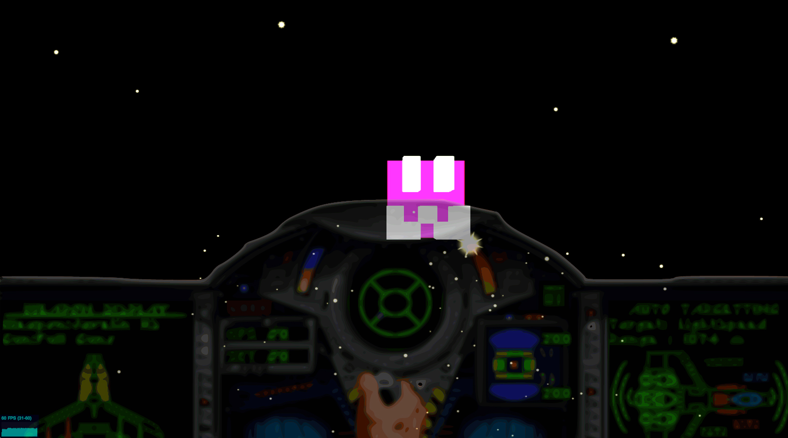

ds.skullCraftIntro
(DemoScene).skullCraftIntro
=============
<pre>
  _______  _______       __      ______ ___________  __     ___            __   _____  ___ ___      ___ __      ________   _______  _______   ________  
 /"     "|/"      \     /""\    /" _  "("     _   ")/""\   |"  |          |" \ (\"   \|"  \"  \    /"  /""\    |"      "\ /"     "|/"      \ /"       ) 
(: ______):        |   /    \  (: ( \___)__/  \\__//    \  ||  |          ||  ||.\\   \    \   \  //  /    \   (.  ___  :|: ______):        (:   \___/  
 \/    | |_____/   )  /' /\  \  \/ \       \\_ /  /' /\  \ |:  |          |:  ||: \.   \\  |\\  \/. ./' /\  \  |: \   ) ||\/    | |_____/   )\___  \    
 // ___)  //      /  //  __'  \ //  \ _    |.  | //  __'  \ \  |___       |.  ||.  \    \. | \.    ///  __'  \ (| (___\ ||// ___)_ //      /  __/  \\   
(:  (    |:  __   \ /   /  \\  (:   _) \   \:  |/   /  \\  ( \_|:  \      /\  |\    \    \ |  \\   /   /  \\  \|:       :|:      "|:  __   \ /" \   :)  
 \__/    |__|  \___|___/    \___)_______)   \__(___/    \___)_______)    (__\_|_)___|\____\)   \__(___/    \___|________/ \_______)__|  \___|_______/   
                                                                                                                                                        
                                                                                                                                                                                     
</pre>

	
Simple game that uses an algorithm to create random fractals in 3d space.  This game borrows jared tarbell http://levitated.net/daily/levInvaderFractal.html and renders the fractals as voxels.  This is a work in progress.
	 

